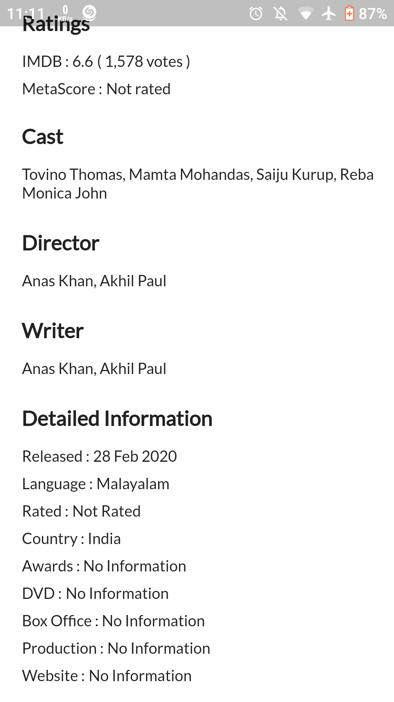

# MooovieX 
A Flutter Application made using Bloc pattern and OMDB API .

  
MooovieX is free and Open Source, Cross Platform Application developed using [Flutter](https://github.com/flutter/flutter).

## About
Online database of information related to films, television programs. Most data in the database is provided by volunteer contributors. 

### The android app lets you:

- Search for any movie, TV series or episodes- including cast, production crew and personal biographies, plot summaries, trivia, ratings, and fan and critical reviews. 
## Screenshots

***
## Permissions

On Android versions prior to Android 6.0, MooovieX requires the following permissions:
- Full Network Access.

It uses the network data to update the app contents regularly and provide the latest informations.

## Contributing

MooovieX  app is a free and open source project. Any contributions are welcome. Here are a few ways you can help:
 * [Report bugs and make suggestions.](https://github.com/wallabag/android-app/issues)
 

## Credits  
Thanks to  Wanicon (https://flaticon.com/authors/wanicon) for the app icon.

## License

This application is released under GNU GPLv3 (see [LICENSE](LICENSE)).
Some of the used libraries are released under different licenses.

