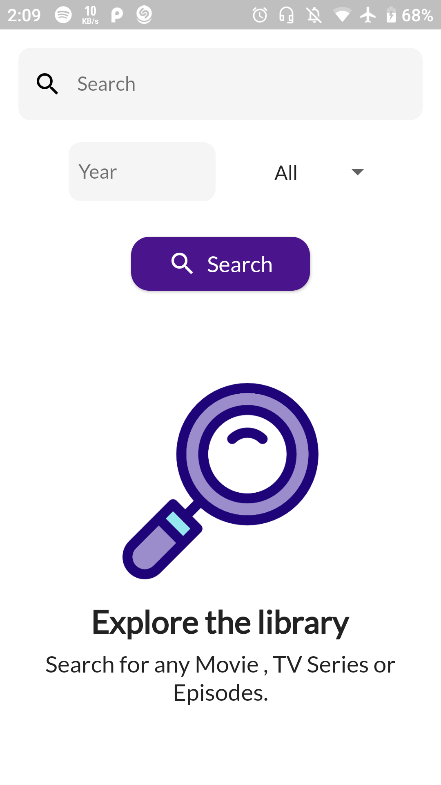
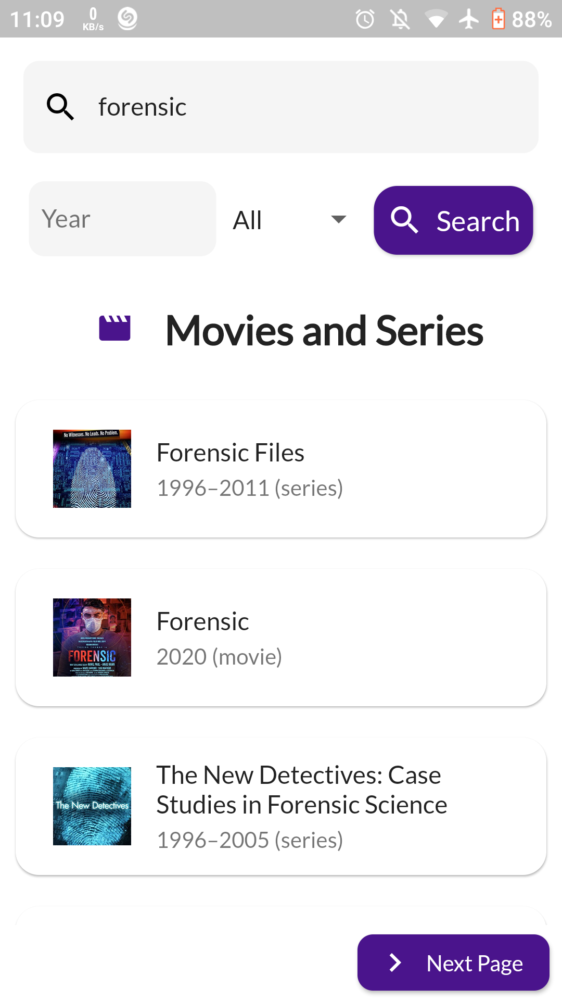
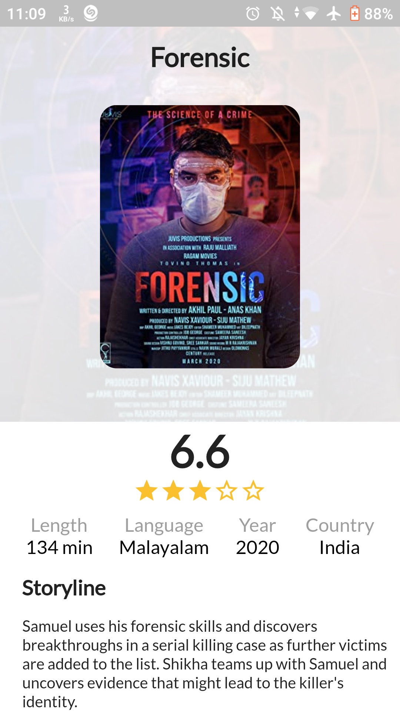
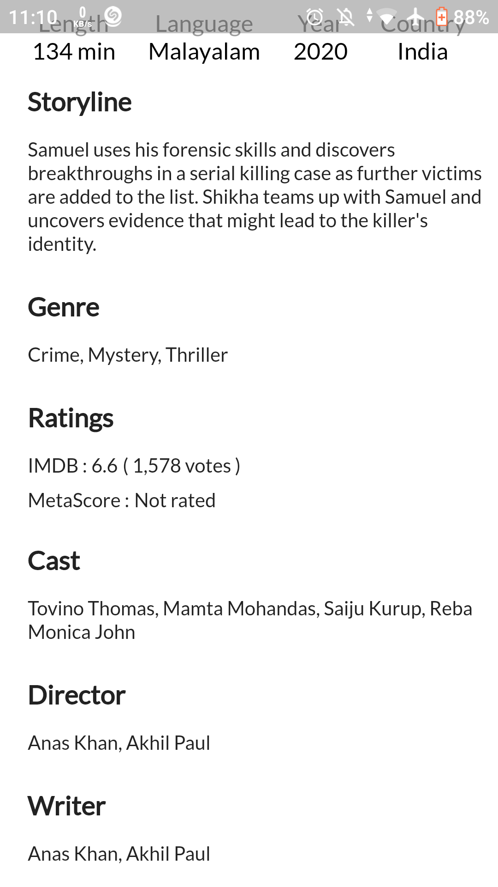
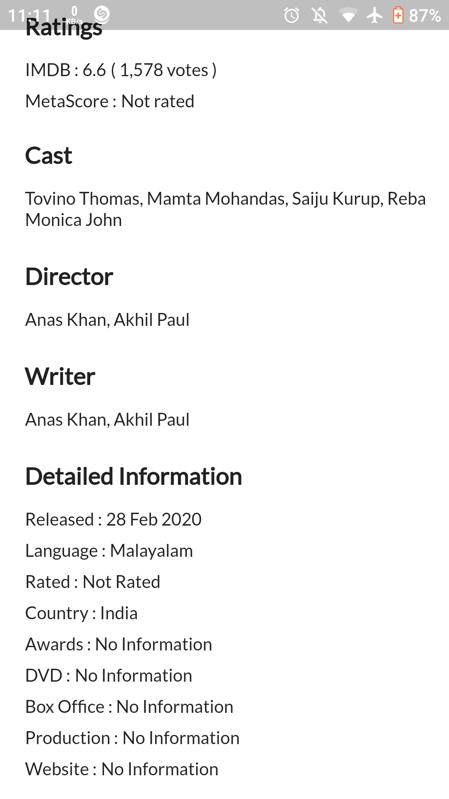

# MooovieX 
A Flutter Application made using Bloc pattern and OMDB API .

  
MooovieX is free and Open Source, Cross Platform Application developed using [Flutter](https://github.com/flutter/flutter).

## Download the App
[](http://www.mediafire.com/file/usaaa4uy5wrox6g/MooovieX.apk/file)


## About
Online database of information related to films, television programs. Most data in the database is provided by volunteer contributors. 


### The android app lets you:

- Search for any movie, TV series or episodes- including cast, production crew, plot summaries and ratings. 

## Screenshots

### Home Screen



### Search



### Result






## Libraries used

```yaml
  http: ^0.12.1 
  flutter_bloc: ^4.0.1  # State management using Bloc 
  google_fonts: ^1.1.0 
  equatable: ^1.2.0
```


## Permissions

On Android versions prior to Android 6.0, MooovieX requires the following permissions:
- Full Network Access.

It uses the network data to update the app contents regularly and provide the latest informations.

## Contributing

MooovieX  app is a free and open source project. Any contributions are welcome. Here are a few ways you can help:
 * [Report bugs and make suggestions.](https://github.com/adarshbalu/moooviex/issues)
 

## Credits  
Thanks to  OMDB API (http://www.omdbapi.com/) for the free movie data.

Thanks to  Freepik (http://www.freepik.com) for the app icon.

## License

This application is released under GNU GPLv3 (see [LICENSE](LICENSE)).
Some of the used libraries are released under different licenses.


